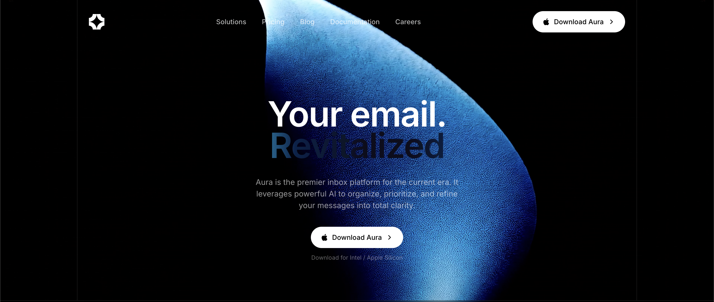

# Aura Email Landing Page

A cinematic email marketing landing page for **Aura** — glassmorphic UI, inbox mockup, feature triage, testimonials, and pricing.



## Stack

- React 18 + TypeScript + Vite
- Tailwind CSS v4
- Motion (animations)
- Lucide React (icons)

## Sections

1. **Navbar** — Floating liquid-glass pill navigation
2. **Hero** — Fullscreen video background with cinematic typography
3. **MacMenuBar** — macOS-style menu bar accent
4. **InboxMockup** — Interactive inbox UI mockup
5. **FeatureTriage** — Feature highlights with triage workflow
6. **LogoCloud** — Partner/client logos
7. **Testimonials** — Social proof carousel
8. **Pricing** — Tiered pricing cards
9. **FinalCTA** — Closing call-to-action

## Run locally

```bash
npm install
npm run dev
```

## Build

```bash
npm run build
npm run preview
```

## Source

Built from the MotionSites `email-landing-page` prompt spec.